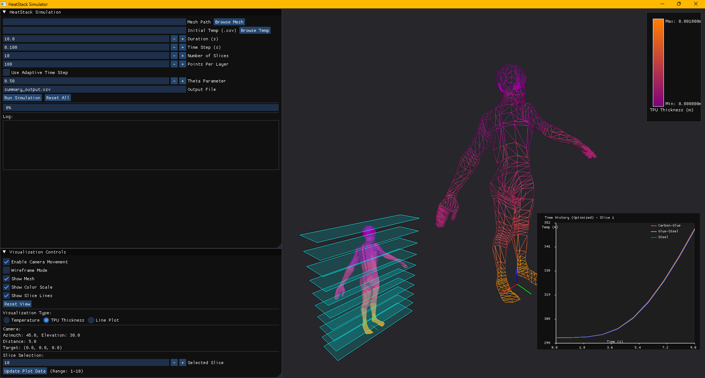
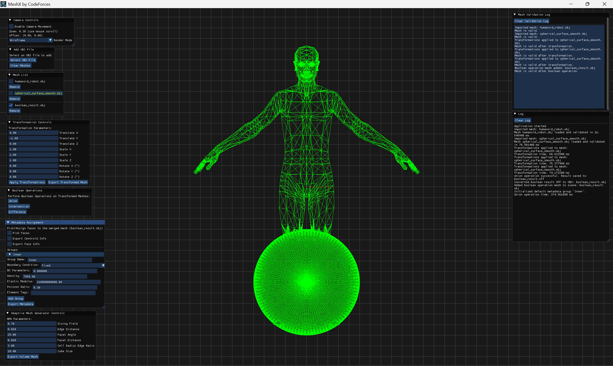

# Repository Overview

This repository hosts the source code and documentation for two software applications developed as part of the **MEEN-689: Applied Computing Concepts** course at Texas A&M University (Spring 2025):

- **HeatStack** – A thermal simulation and analysis toolkit.
- **MeshX** – A comprehensive 3D mesh processing platform.

Each application is contained in its own directory and includes a dedicated README with build instructions, usage examples, and technical documentation.

---

## Applications

### 🔥 HeatStack: 1D Composite-Material Heat-Equation Solver

HeatStack is a high-performance tool designed to solve the 1D transient heat equation for composite materials under extreme, long-duration thermal loads. Inspired by NASA insulation design challenges, it processes any 3D mesh by slicing it into 1D stacks along the Z-axis, solving the heat equation for each stack using advanced numerical methods (BTCS or Crank–Nicholson). HeatStack also includes a thermal comparator to recommend optimal insulation thicknesses based on user-defined temperature criteria.

Key features include:

- Automatic slicing of 3D meshes into 1D stacks for simulation.
- Configurable simulation parameters, including boundary conditions and material properties.
- Support for composite material layers with customizable thermal properties.
- Recommendations for insulation thickness to meet thermal performance goals.


For setup and usage instructions, see the [HeatStack README](./HeatStack/README.md).


---

### 🧊 MeshX: 3D Mesh Processing Framework

MeshX provides a robust set of tools for working with surface and volumetric meshes. Designed with extensibility and usability in mind, it includes:

- Support for common mesh file formats (import/export).
- Mesh transformations: translation, rotation, and scaling.
- Boolean operations: union, intersection, difference.
- Volume mesh generation from surface geometry.
- An intuitive GUI for user interaction.

Detailed documentation is available in the [MeshX README](./MeshX/README.md).


---

## Clone Instructions

Make sure you clone with `--recurse-submodules` enabled to get the required libraries:

```sh
git clone --recurse-submodules link/to/repo
```

---

## License

This project is licensed under the terms of the [MIT License](./LICENSE).
